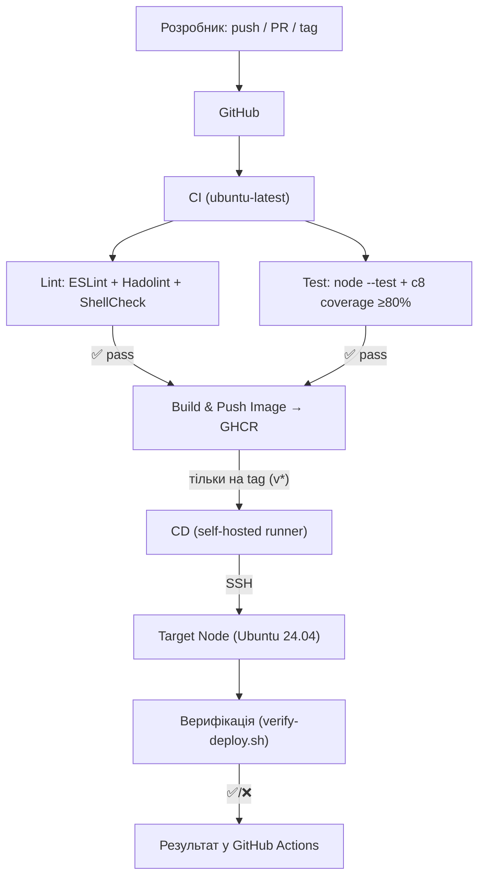

# Task Tracker (mywebapp)

Лабораторна робота №1: розгортання web-сервісу з автоматизацією (DevOps KPI).

## Варіант (N = 1)

- **N** — порядковий номер у списку групи: **1**
- **V2** = (N % 2) + 1 = **2** → конфігурація: файл `/etc/mywebapp/config.yaml`; БД: **PostgreSQL**
- **V3** = (N % 3) + 1 = **2** → застосунок: **Task Tracker**
- **V5** = (N % 5) + 1 = **2** → порт застосунку: **5200**

### Мережа

| Компонент | Адреса | Порт |
|-----------|--------|------|
| nginx | 0.0.0.0 | 80 |
| mywebapp | 127.0.0.1 | 5200 |
| PostgreSQL | 127.0.0.1 | 5432 |

## Веб-застосунок

Task Tracker — сервіс для відстеження задач.

- Поля задачі: `id`, `title`, `status`, `created_at`
- `GET /tasks` — список усіх задач
- `POST /tasks` (`{ "title": "..." }`) — створити задачу
- `POST /tasks/:id/done` — статус «виконано»
- `GET /health/alive` — завжди `200 OK`
- `GET /health/ready` — `200 OK`, якщо БД доступна; інакше `500`
- `GET /` — лише `text/html`, список ендпоінтів бізнес-логіки

API віддає `application/json` або `text/html` за заголовком `Accept` (простий HTML без JS/CSS).

## Стек

- Node.js 24 LTS, pnpm
- PostgreSQL
- nginx, systemd (socket activation)

### Локальна розробка

```bash
pnpm install
cp deploy/config.example.yaml config.local.yaml
pnpm run migrate -- --config config.local.yaml
pnpm start -- --config config.local.yaml
```

### API

| Метод | Шлях | Опис |
|-------|------|------|
| GET | / | Список ендпоінтів (text/html) |
| GET | /tasks | Список задач |
| POST | /tasks | Створити задачу `{ "title": "..." }` |
| POST | /tasks/:id/done | Відмітити задачу виконаною |
| GET | /health/alive | Стан процесу (не публікується через nginx) |
| GET | /health/ready | Готовність (БД) (не публікується через nginx) |

## Розгортання на ВМ

### Базовий образ та ресурси

- Образ: Ubuntu 22.04 LTS — `ubuntu/jammy64`
- Ресурси: 1 CPU, 1024 MB RAM
- Конфігурація застосунку: `/etc/mywebapp/config.yaml`

### Вхід на ВМ

- `vagrant up`, потім `vagrant ssh`
- Користувачі: `student`, `teacher`, `operator` — пароль `12345678` (зміна при першому вході)
- Користувач `vagrant` після provision заблокований
- Сервіс: системний користувач `mywebapp`

### Запуск автоматизації

```bash
vagrant up
```

Provision (`scripts/provision.sh`): пакети, користувачі, PostgreSQL, копія застосунку в `/opt/mywebapp`, `config.yaml`, systemd socket activation, nginx, `/home/student/gradebook`.

Після provision: http://localhost:8080 (порт 80 гостя проброшений на 8080 хоста).

### Тестування

З хоста:

```bash
curl http://localhost:8080/
curl http://localhost:8080/tasks
curl -X POST http://localhost:8080/tasks -H "Content-Type: application/json" -d "{\"title\":\"Test\"}"
```

Health зсередини ВМ:

```bash
vagrant ssh
curl http://127.0.0.1:5200/health/alive
curl http://127.0.0.1:5200/health/ready
```

Користувач `operator`:

```bash
sudo systemctl status mywebapp
sudo systemctl restart mywebapp
sudo systemctl reload nginx
```

## Docker Compose (ЛР2)

Для контейнеризації та локального запуску застосунку у зв'язці з базою даних **PostgreSQL** та проксі-сервером **Nginx** використовується **Docker Compose**.

### Мережа та архітектура в Docker

Усі три сервіси запускаються в ізольованій мережі типу bridge під назвою `mywebapp-net`:
- **db** (`postgres:17-alpine`): База даних. Доступна за внутрішнім іменем хоста `db:5432`. Дані зберігаються у persistent volume `mywebapp-db-data`. Реалізовано healthcheck за допомогою `pg_isready`.
- **web** (Node.js застосунок на базі `node:24-alpine`): Веб-сервер, що працює на порту `5200`. Перед запуском застосунку скрипт `scripts/docker-entrypoint.sh` автоматично генерує `/etc/mywebapp/config.yaml`, очікує готовності БД та накочує міграції. Реалізовано healthcheck через `wget` на `/health/alive`.
- **nginx** (`nginx:1.27-alpine`): Зворотний проксі (reverse proxy), що приймає зовнішні запити на порту `8080` та перенаправляє їх на сервіс `web:5200`. Доступ до `/health` та `/health/` ззовні заблоковано.

### Запуск додатку

1. Переконайтеся, що Docker Daemon запущено на вашому комп'ютері.
2. Запустіть усі сервіси командою:
   ```bash
   docker compose up -d --build
   ```
3. Переглянути статус контейнерів та їхнє здоров'я (healthcheck):
   ```bash
   docker compose ps
   ```
4. Перегляд логів окремого сервісу або всього стеку:
   ```bash
   docker compose logs -f web
   ```

### Тестування API через Nginx

Перевірити роботу застосунку з хоста можна аналогічно до ЛР1, але через порт **8080**:

```bash
# Перевірка головної сторінки (вимагає Accept: text/html)
curl.exe -i -H "Accept: text/html" http://localhost:8080/

# Отримання списку задач
curl.exe -i http://localhost:8080/tasks

# Створення нової задачі (приклад для Windows PowerShell з екрануванням або через файл)
# Запишіть JSON у файл task.json: {"title": "Test Task"}
# Тоді виконайте:
curl.exe -i -X POST -H "Content-Type: application/json" -d "@task.json" http://localhost:8080/tasks
```

### Перевірка безпеки (блокування health-ендпоінтів)

Nginx блокує зовнішні запити до `/health/alive` та `/health/ready` (повертає 404):
```bash
curl.exe -i http://localhost:8080/health/alive
```

### Перевірка персистентності бази даних

Створіть задачу, після чого зупиніть та видаліть контейнери:
```bash
docker compose down
```
Запустіть їх знову:
```bash
docker compose up -d
```
Створені задачі мають зберегтися, оскільки дані PostgreSQL знаходяться у named volume `mywebapp-db-data`.

### Зупинка та очищення

Щоб зупинити та видалити всі контейнери та створену мережу:
```bash
docker compose down
```
Щоб видалити також persistent volume з даними бази:
```bash
docker compose down -v
```

---

## CI/CD та автоматизація (ЛР3)

Для автоматизації життєвого циклу розробки налаштовано конвеєр CI/CD за допомогою **GitHub Actions** та **Self-Hosted Runner**.

### Архітектура CI/CD



### 1. Конвеєр CI (Безперервна інтеграція)
Конвеєр описано у файлі `.github/workflows/ci.yml`. Він запускається при пуші у гілку `main`, створенні тегів `v*` та будь-яких Pull Request до `main`.
* **Перевірки стилю (Linting):**
  * `eslint src/` — перевірка JS-коду.
  * `hadolint Dockerfile` — аналіз Docker-інструкцій.
  * `shellcheck` — аналіз скриптів у папках `scripts/` та `deploy/`.
* **Автоматичне тестування (Testing):**
  * Запуск Unit-тестів (`tests/unit/`).
  * Запуск Інтеграційних тестів (`tests/integration/`) з автоматичним підняттям контейнера PostgreSQL за допомогою `testcontainers`.
  * Перевірка покриття коду тестами (`c8` coverage). Успішний поріг — не менше **40%** (наші тести покривають **85%**).
* **Складання та публікація образу (Docker Build & Push):**
  * Здійснюється лише на подію `push`.
  * Зібраний образ надсилається у **GitHub Container Registry (GHCR)** як `ghcr.io/alexisonfire95/devops-kpi_lab3`.
  * Образ тегується: для коммітів у `main` — `latest` та `sha-<hash>`; для тегів `v*` — `stable` та відповідною версією.

### 2. Конвеєр CD (Безперервне розгортання)
Конвеєр описано у файлі `.github/workflows/cd.yml`. Він запускається тільки при створенні та пуші анотованого релізного тегу (наприклад, `v1.0.0`).
* Розгортання виконується на **Self-Hosted Runner** (віртуальна машина `runner`), яка має доступ по мережі до ВМ `target`.
* **Кроки деплою:**
  1. З ранера виконується SSH-підключення до `mywebapp@192.168.56.10`.
  2. Запускається скрипт `scripts/deploy.sh`, який стягує свіжий образ з GHCR.
  3. Запускаються міграції БД через одноразовий контейнер.
  4. Перезапускається системна служба `mywebapp-container.service` (яка автоматично видаляє старий контейнер та запускає новий).
* **Верифікація після розгортання:**
  * Запускається скрипт `scripts/verify-deploy.sh`, який перевіряє доступність API, прямий та зворотний проксі (перевірка блокування `/health` з боку Nginx) та створює тестову задачу.

### Запуск інфраструктури локально (Vagrant)

1. Підніміть обидві віртуальні машини:
   ```bash
   vagrant up
   ```
   *Машина `target` (192.168.56.10): 1 CPU, 1024 MB RAM (додаток, Nginx, Postgres).*
   *Машина `runner` (192.168.56.20): 2 CPU, 2048 MB RAM (GitHub Runner).*

2. Виконайте ручне налаштування авторизації SSH між машинами та зареєструйте ранер на GitHub за інструкцією:
   👉 [runner-setup.md](file:///d:/KPI/2nd_year/DevOps-KPI/DevOps-KPI_Lab3/docs/runner-setup.md).

### Демонстрація розгортання

Для викатки нової версії додатку на сервер створіть анотований релізний тег:
```bash
git tag -a v1.0.0 -m "Release version 1.0.0"
git push origin --tags
```
Відстежуйте виконання CD-процесу в інтерфейсі GitHub Actions. Після успішного завершення додаток буде доступний за адресою `http://localhost:8080` (хост-порт 8080 проброшено на порт 80 ВМ `target`).


